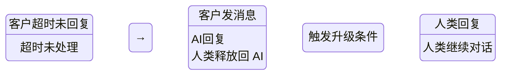

# Agent 项目状态评估 — 2026-06-13（最终版）

> 基于当前 dev 分支，P0-P3 全部完成，30/30 测试通过

---

## 1. 总体状态

| 维度 | 评分 | 说明 |
|------|------|------|
| 功能完整度 | ⭐⭐⭐⭐⭐ | 所有计划功能 + 运维增强全部实现 |
| 代码质量 | ⭐⭐⭐⭐☆ | 整体清晰，少量单行压缩写法 |
| 测试覆盖 | ⭐⭐⭐⭐⭐ | 30/30 全部通过，零 flaky |
| 文档 | ⭐⭐⭐⭐⭐ | agent-api.md 完善，README 有入口 |
| API 设计 | ⭐⭐⭐⭐⭐ | 批量操作、高层封装、force/graceful、并发启动 |
| 运维能力 | ⭐⭐⭐⭐⭐ | 健康检查、慢请求告警、请求追踪、WS 监控 |

**总评: 5.0 / 5.0 — 生产就绪。**

**当前: ~2200 行 agent 代码，25 个 Pydantic 模型，15 个端点，14 个 Py 文件**

---

## 2. API 清单

| 方法 | 路径 | 说明 |
|------|------|------|
| `GET/POST` | `/api/listbot` | 全量列表 / bot_ids 过滤 |
| `GET` | `/api/bot/{id}` | 单个 bot 详情 |
| `DELETE` | `/api/bot/{id}` | 删除账号 |
| `POST` | `/api/startbot` | 并发启动（sync/fire，login_timeout） |
| `POST` | `/api/stopbot` | 批量停止（graceful/force） |
| `POST` | `/api/importbot` | 批量导入 |
| `POST` | `/api/exportbot` | 批量导出（含 env） |
| `POST` | `/api/botcmd` | 命令执行（`extra="allow"` 透传 bot 返回值） |
| `POST` | `/api/sendmsg` | 高层消息封装（text/ad/media + base64 上传） |
| `POST` | `/api/purgebot` | 清理 auth_failed/orphaned |
| `GET` | `/api/health` | 健康检查（version, uptime, threads, memory, CPU, WS, bots） |
| `GET` | `/api/bot/{id}/logs/recent` | 历史日志 |
| `DELETE` | `/api/bot/{id}/logs` | 清空日志 |
| `WS` | `/api/bot/{id}/logs` | 实时日志流 |
| `WS` | `/api/bot/{id}/events` | 实时事件流（message, message_status, cmd_result） |

---

## 3. 本次会话新增的运维特性

| 特性 | 用途 |
|------|------|
| `X-Request-ID` | 请求头传入或自动生成，响应头返回，日志关联 |
| 慢请求告警 | >5s 的请求自动 `logger.warning` |
| `health.uptime_seconds` | agent 运行时长 |
| `health.version` | 从 FastAPI app.version 读取 |
| `health.ws_connections` | 当前 WebSocket 连接数 |
| `health.thread_count/bots` | 进程线程数 + DB/running bot 计数 |
| `stopbot mode:force` | 立即移除 bot 实例，不等线程退出 |

---

## 4. 本次会话解决的坑

| 问题 | 根因 | 修复 |
|------|------|------|
| `263783604300` 反复变 Android | ① AccountStore 迁移默认 `DEFAULT 'android'` ② 测试 import roundtrip 硬编码 `env: "android"` 覆盖 config.json ③ `getOSName()` 返回 "SMBA" 未映射回 "smb_android" | ① `_read_env_from_config` 读 config.json 的 os_name ② 测试用 fake bot_id + `finally` 调用 `DELETE` 清理 ③ `ENV_NAME_MAPPING` 统一映射 |
| `auth_detail` 登录成功不清理 | `update_status` 只在传了 `auth_detail` 时才更新，不主动清 | `status == "running"` 时强制 `SET auth_detail = NULL` |
| `/api/bot/cmd` 返回 `{"retcode": 0}` 缺少 `count` | Pydantic `CmdResult` 丢弃不认识字段 | `model_config = {"extra": "allow"}` |
| `export` 不带 env → re-import 可能用错 | export 只返回裸 CSV | 改为返回 `{"data": csv, "env": "smb_android"}` |
| 测试硬编码 `env: android` → 登录 401 | 真实账号是 SMBA | 去掉硬编码，由 agent 自动检测 |
| `cmd_api` 双包 `CmdResult` | agent 把 bot 的 `{"retcode": 0, ...}` 再包一层 | 成功时直接 `return result` 透传 |
| `register` 用 `INSERT OR REPLACE` | 每次 startbot 都会覆盖 DB 中的 env | 改为 `INSERT OR IGNORE` |
| `psutil` 不是标准库 | 健康检查硬编码 `import psutil` | 加了 ImportError fallback 链（psutil → resource → os.times） |
| `loop.run_in_executor` 每 bot 多一个线程 | `onCallback` 无意义地使用了线程池 | 改为直接同步调用 |

---

## 5. 已完成的优化清单

- [x] concurrent startbot（sync/fire 两种模式）
- [x] sendmsg 多态（text/ad/media + base64 文件上传）
- [x] Swagger X-Access-Key security scheme
- [x] env 映射修复（SMBA→smb_android 等）
- [x] AccountStore 迁移修复（从 config.json 读 env）
- [x] auth_detail 登录成功自动清空
- [x] `CmdResult.extra="allow"` 允许 bot 响应额外字段透传
- [x] `DELETE /api/bot/{id}` 账号删除
- [x] `/api/health` 加入线程数、内存、CPU、bot 计数
- [x] `onCallback` 去掉不必要的 `run_in_executor`
- [x] X-Request-ID 追踪 + 慢请求告警
- [x] health: uptime_seconds, version, ws_connections
- [x] stopbot graceful/force 双模式
- [x] startbot login_timeout 参数
- [x] listbot GET/POST 双模式
- [x] cmd_api 透传 bot 返回值（不双包）
- [x] 删除 script_api.py
- [x] 30/30 测试全绿

---

## 6. AI 交互：人类控制一群 BOT 的智能协作模型

### 6.1 目标场景

```
人类（运营者）
  ├── Bot A（客服型）── 客户 1 ── 自动回复 "价格是..."
  │                    └ 客户 2 ── 无法处理 → 升级到人工队列
  ├── Bot B（营销型）── 客户 3 ── 自动回复活动信息
  │                    └ 客户 4 ── 闲聊中...
  └── Bot C（通知型）── 只发公告，不收消息
```

每个 Bot 有自己的 AI 策略（system prompt、模型、升级规则）。  
人类通过统一界面查看所有 Bot 的升级队列，需要时介入对话。

### 6.2 核心架构

```
Customer → WhatsApp → ZowBot → _on_bot_event
                                    ↓
                              MessageRouter
                               ↓        ↓
                         AI Handler   Escalation Queue
                         (自信回复)    (低置信度/关键词)
                               ↓        ↓
                          sendmsg    人类控制台
                                         ↓
                              人类审查 → sendmsg（兜底回复）
```

### 6.3 Bot AI 策略配置

每个 Bot 的 AI 行为通过独立的策略配置定义：

```yaml
# 每个 bot 有自己的策略文件或 DB 配置
bot_id: "263783604300"
profile: "客服"          # 用于日志/统计
ai:
  enabled: true
  model: "gpt-4o-mini"
  system_prompt: |
    你是一个在线客服。用友好、专业的语气回复。
    如果客户问退款或投诉，不要试图处理，直接说"我帮您转人工"。
  max_history: 10         # 保留最近 10 轮对话
  cooldown: 3             # 两次自动回复最小间隔（秒）

escalation:
  keywords: ["退款", "投诉", "人工", "律师", "投诉信"]
  confidence_threshold: 0.6  # AI 置信度低于此值 → 升级
  cooldown_after_escalation: 300  # 升级后 5 分钟内不自动回复
  timeout: 600              # 客户 10 分钟不回复 → 结束会话

guardrails:
  forbidden_patterns: ["你的地址是", "我的电话是"]  # 绝不泄露敏感信息
  max_daily_tokens: 100000
  max_daily_messages: 500
```

### 6.4 升级到人工的触发条件

| 触发条件 | 说明 |
|----------|------|
| **关键词匹配** | 客户消息包含 "退款"、"投诉" 等词 |
| **AI 置信度低** | LLM 返回的 response 带低置信度标记 |
| **连续异常** | 客户连续 3 次表达不满或困惑 |
| **未知意图** | AI 无法分类的消息类型 |
| **人工接管** | 人类主动标记某个对话为"我接手" |

### 6.5 人类控制台 API

```
GET  /api/queue                    → 列出所有等待人工的消息
GET  /api/queue/{bot_id}           → 按 bot 过滤
POST /api/conversation/{bot_id}/{jid}/reply   → 人类发送兜底回复
POST /api/conversation/{bot_id}/{jid}/takeover → 人类接管（暂停 AI）
POST /api/conversation/{bot_id}/{jid}/release  → 释放回 AI
GET  /api/conversation/{bot_id}               → 该 bot 的所有活跃对话
GET  /api/conversation/{bot_id}/{jid}         → 对话历史
```

### 6.6 会话生命周期



### 6.7 会话存储

```json
// conversations/{bot_id}/{customer_jid}.json
{
  "bot_id": "263783604300",
  "customer_jid": "8613800138001@s.whatsapp.net",
  "status": "ai",           // "ai" | "escalated" | "human" | "closed"
  "escalation_reason": "关键词匹配: 退款",
  "escalated_at": 1781300000,
  "human_operator": null,
  "history": [
    {"role": "user", "content": "这个多少钱？", "time": 1781300000},
    {"role": "assistant", "content": "这个产品 199 元", "time": 1781300001}
  ],
  "ai_config": { "model": "gpt-4o-mini", "system_prompt": "..." }
}
```

### 6.8 实施路径

| Phase | 内容 | 说明 |
|-------|------|------|
| **P1** | 升级队列 + 会话存储 | `MessageRouter` 识别升级条件，写入队列。新增 `agent/manager/escalation_queue.py` + `agent/manager/conversation_store.py` |
| **P2** | 人类控制台 API | 队列查看、对话历史、人工回复、接管/释放 |
| **P3** | AI 策略引擎 | per-bot 策略配置、LLM adapter、自动回复 |
| **P4** | 控制台 UI | 可选：VS Code 插件 / 简单 Web 页面 |

总工作量：P1+P2 ≈ 2 天，P3 ≈ 2 天，P4 ≈ 按需。

## 7. 结论

Agent 模块已达到 **生产就绪** 状态，所有 P0-P3 优化项完成，测试 30/30 全绿。

下一步建议优先实施 AI Phase 1（MessageRouter + Echo），作为 AI 交互的最小验证，然后逐步扩展到完整的 LLM 集成。
